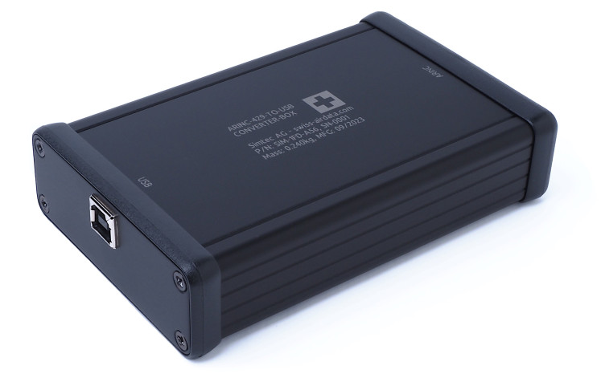

# Swiss Air-Data C Decoder
  
## Overview

This small C software decodes and encodes 32 bits long ARINC-429 data wordx that are received by or respectively transmitted to an ARINC-429-TO-USB converter box from Simtec AG <https://www.swiss-airdata.com/products/accessoires/arinc>.




It is composed of two executables: _arinc_rx.exe_ and _arinc_tx.exe_. 

The first one, _arinc_rx.exe_, will decode 32 bits data words sent through ARINC-429 and then converted into USB by the ARINC-429 to USB converter box from Simtec AG. The decoded message will then simply be printed in hexadecimal format on the terminal.

The second one, _arinc_tx.exe_, will ask the user to enter a 32 bits long data word. This data word will then be transmitted to the ARINC-429 to USB converter box. The user can enter the data in octal, decimal or hexadecimal format.

## Usage

### Compilation
Execute the following commands:

```
make compile_tx
make compile_rx
```

### Execution
Launch the following commands:
```
arinc_rx serial-port [baudrate]
arinc_tx serial-port [baudrate]
```
Arguments:
- _serial-port_: Serial port on which the air data computer is connected. 
- _baudrate_: Optional argument setting the baudrate which the air data computer uses. By default 230400 is used.

Example calls:
```
arinc_rx COM3
arinc_tx COM7
```

## Integration
This software has been developed with the goal to ease its reusability as much as possible. 

The core decoder _arinc_box_translator.c_ and _arinc_box_translator.h_ has been implemented to run on almost any hardware. It only depends on the C standard libraries _stdint.h_, _stdbool.h_, _stdlib.h_ and _string.h_. You can very well take those two files and integrate them in your own code.

## Notes

Compiled with gcc version 10.2.0 (GCC) on windows 10 with mingw64 <http://mingw-w64.org/doku.php>.

Example code only. Use at own risk.

This library is distributed in the hope that it will be useful, but WITHOUT ANY WARRANTY; without
even the implied warranty of MERCHANTABILITY or FITNESS FOR A PARTICULAR PURPOSE.

Simtec AG has no obligation to provide maintenance, support,  updates, enhancements, or modifications.
